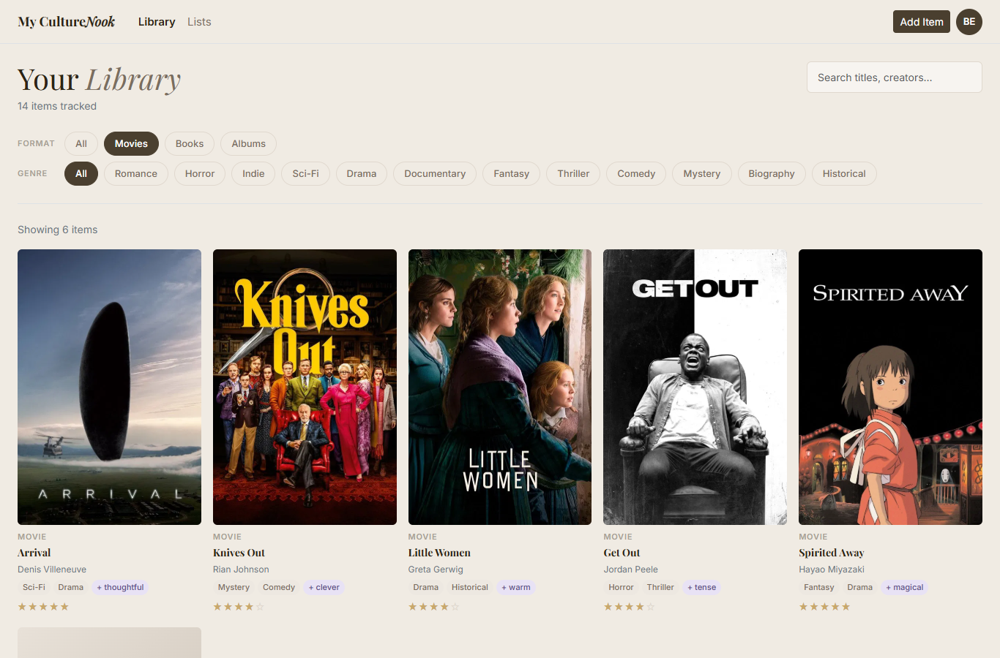
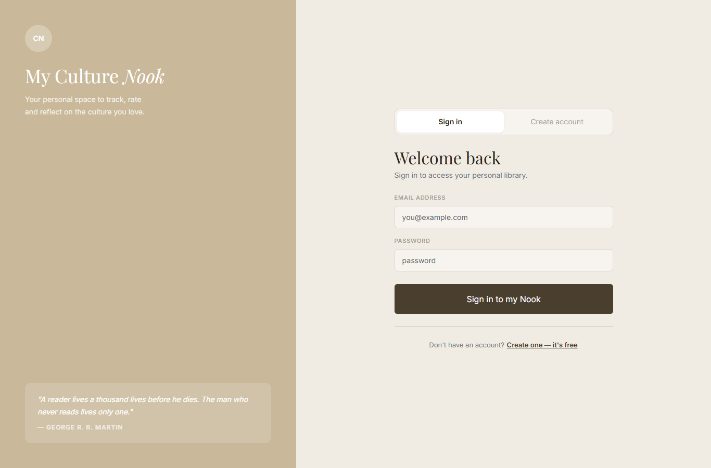
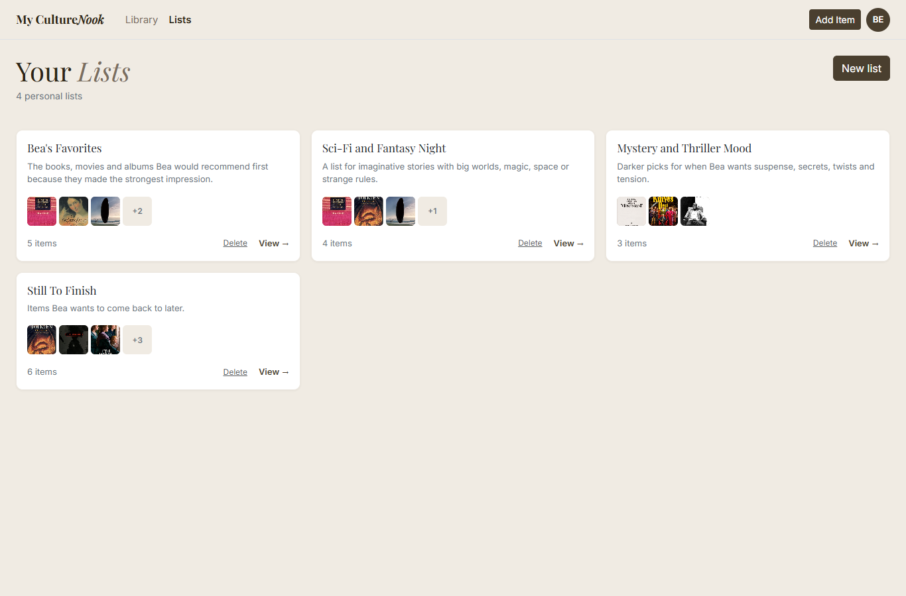
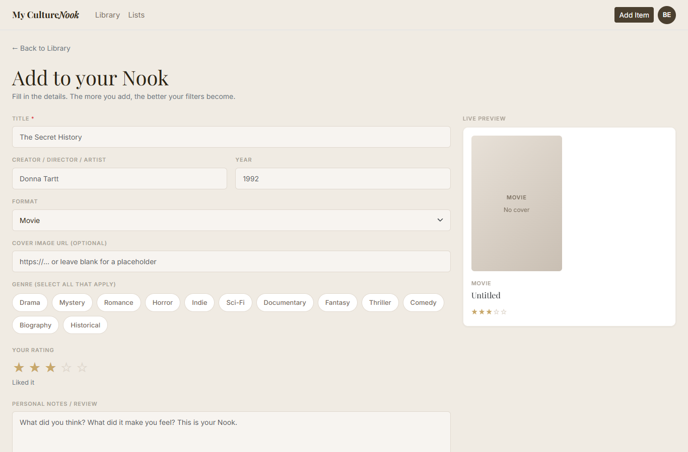

# My Culture Nook

A personal media library built with **React**. You can keep track of the books, movies and albums you love, rate them, write your own notes, tag them with genres and custom "vibes", and group them into lists.



## About the Project

Culture Nook was developed as a project for a front-end / React course. It puts the course topics into practice in one complete application: components and props, state and events, forms and validation, shared state with Context, HTTP requests to a REST API, React Router and responsive design.

## Features

- **Sign in / create account:** a simulated login (see [Authentication](#authentication) below). Each email address gets its own separate library.
- **Library:** a responsive grid of cover cards with a live **search** by title or creator and **filters** by format (movies, books, albums) and genre.
- **Add and edit items:** a form with title, creator, year, format, cover URL, genres, a 1–5 star rating, personal notes and custom vibe tags. A **live preview card** updates while you type.
- **Item detail page:** cover, rating label (from "Not for me" to "Masterpiece"), details, tags and your notes. Items can be edited or deleted.
- **Lists:** create named lists with a description, add or remove items, rename lists and delete them. Deleting an item also removes it from every list.
- **Cover fallback:** if an item has no cover, or the image fails to load, a styled placeholder with the format and title is shown instead.
- **Error page:** a custom 404 / error screen for unknown routes.

| Sign in | Lists | Add an item |
|---|---|---|
|  |  |  |

*Screenshots are from a local run of the app with the sample data in `db.json`.*

## Technologies

| Technology | Role in the project |
|---|---|
| **React 19** | UI built from function components and hooks (`useState`, `useEffect`, `useContext`) |
| **React Router 6** | Client-side routing with `createBrowserRouter`, nested routes, `<Outlet />`, dynamic params (`useParams`) and an `errorElement` |
| **React Context** | Global state for the user, items and lists (`LibraryContext`) |
| **json-server** | Fake REST API that stores data in `db.json` (port 3001) |
| **Bootstrap 5 + React-Bootstrap** | Responsive grid (`Row`/`Col`), form controls and utility classes |
| **Custom CSS** | Visual identity through CSS variables (colours and fonts), cards, tags and the star rating |
| **Create React App** | Development server, build and test setup |
| **Jest + React Testing Library** | One test that checks the login page is shown to signed-out users. It currently fails because its `/sign in/i` text query matches several elements on the page. |

## How It Works

### Architecture

```text
             ┌──────────────────────────────┐
             │       LibraryProvider        │  src/store/LibraryContext.jsx
             │  user · items · lists        │
             │  loading · error · CRUD fns  │
             └──────────────┬───────────────┘
                            │ useLibrary()
     ┌──────────────┬───────┴──────┬──────────────┐
  Library        ItemDetail      EditItem      Lists / ListDetail   (pages)
     │                                              │
  ItemCard · MediaCover · StarRating · ListCard · Navbar   (components)
                            │
                    fetch() │ GET / POST / PUT / DELETE
                            ▼
             json-server  →  db.json  (http://localhost:3001)
```

- **`LibraryContext`** is the single source of truth. When the user changes, it loads that user's items and lists (`GET /items?userId=…`, `GET /lists?userId=…`) and exposes `addItem`, `updateItem`, `deleteItem`, `addList`, `updateList` and `deleteList`. Every function first calls the API, then updates local state immutably with the server's response.
- **Pages** read and change data only through the `useLibrary()` hook, so no props have to be passed down through many levels.
- **Loading and error states** are tracked in the context and shown in the pages.
- A cleanup flag in `useEffect` prevents state updates from an outdated request if the user switches account while data is loading.

### Routing

| Path | Page |
|---|---|
| `/login` | Sign in / create account |
| `/` | Library (index route) |
| `/items/:id` | Item detail |
| `/edit/new` | Add a new item |
| `/edit/:id` | Edit an existing item |
| `/lists` | All lists |
| `/lists/:id` | List detail |
| `*` | Error / 404 page |

All routes except `/login` are children of `RootLayout`, which redirects to `/login` when nobody is signed in.

### Authentication

Login is **simulated on the front end**, which is enough for this course project but not real security:

- The form validates the email format and requires a password of at least 6 characters, but the password is **not stored or checked** anywhere.
- The signed-in user (email, display name and initials) is saved in `localStorage`, so the session survives a page refresh.
- The normalised email is used as the `userId`, and every item and list in `db.json` is tagged with it. This keeps each user's library separate.

### Forms

The forms are **controlled components**. The item form validates the required title (on blur and on submit), toggles genres, adds vibe tags with Enter or a button, and renders a live preview from the same form state.

## Project Structure

```text
culture-nook-app/
├── db.json                  # json-server database with sample items and lists
├── public/                  # index.html, favicon and app icons
└── src/
    ├── App.js               # Router configuration
    ├── index.js             # Entry point, imports Bootstrap and global CSS
    ├── index.css            # Theme variables and custom styles
    ├── store/
    │   └── LibraryContext.jsx   # Global state and API calls
    ├── pages/               # Route-level pages (Library, ItemDetail, EditItem, Lists, ListDetail, Login, RootLayout, ErrorPage)
    └── components/          # Reusable UI (Navbar, ItemCard, ListCard, MediaCover, StarRating)
```

## Getting Started

### Requirements

- [Node.js](https://nodejs.org/) and npm

### Installation

```bash
git clone https://github.com/beatrizestfr/culture-nook-app.git
cd culture-nook-app
npm install
```

### Run

The app needs **two terminals**, one for the API and one for the React app.

Terminal 1, start the fake REST API on http://localhost:3001:

```bash
npm run server
```

Terminal 2, start the React development server on http://localhost:3000:

```bash
npm start
```

Then sign in with any valid email address and a password of at least 6 characters. To see the sample library from the screenshots, sign in with `bea@gmail.com`, one of the demo accounts in `db.json`.

### Other scripts

| Command | What it does |
|---|---|
| `npm run build` | Creates a production build in `build/` |
| `npm test` | Runs the test suite in watch mode |

## What This Project Demonstrates

- Structuring a React app into pages, reusable components and a state layer
- Sharing state with Context and a custom hook instead of prop drilling
- Full CRUD against a REST API with `fetch`, `async`/`await`, and loading and error handling
- Nested and dynamic routes, redirects and error boundaries with React Router
- Controlled forms with validation and immediate visual feedback
- Responsive layouts with the Bootstrap grid combined with custom CSS

## Possible Improvements

- Real authentication with a backend (hashed passwords, tokens) instead of the simulated login
- Fix some sample cover URLs in `db.json` that point to the wrong book covers
- Search and add items automatically through a public API (for example Open Library or a movie database)
- Sorting (by rating, year or title)
- Make the existing test query more specific (for example `getByRole('button', { name: 'Sign in' })`) and add more tests for the pages and the context
- Deploy a live demo with a hosted API

## Project Status

Completed as a course project. The features above are implemented. The ideas under *Possible Improvements* are not.
